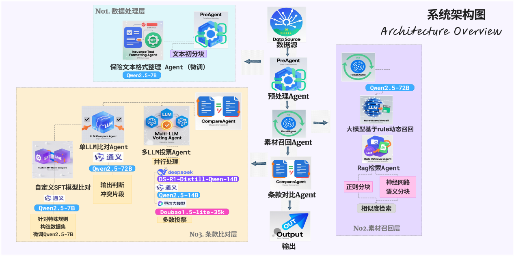

# Financial Consistency Framework

> **金融条款一致性智能对比系统** ——by 喜多郁代

<div align="center">


</div>

## 项目简介

FinancialConsistency 是一个基于先进大模型技术的金融条款一致性对比框架。该系统采用多智能体协作架构，结合召回模块、分块模型和对比模块，实现对金融条款的精细化解析与一致性判断。

本系统专为保险合规场景设计，通过微调技术和 RAG（检索增强生成）技术，完成对保险长文本的智能化解析、校验和冲突检测，助力保险行业实现智能合规转型，显著提升审核效率并降低人工成本。

## 核心特性

### 🏗️ 模块化架构
- **全解耦设计**：支持各功能模块的独立替换和升级
- **灵活扩展**：便于集成新的算法模型和业务逻辑

### 🚀 高性能处理
- **多模型支持**：兼容多种大语言模型，提供灵活的模型选择
- **智能分块**：结合规则与神经网络的分块策略，优化长文本处理

### 🎯 精准对比
- **多层次对比**：支持单模型、自定义模型及多模型集成对比
- **投票策略**：可选多模型投票机制，提升判断准确性

### ⚙️ 可配置化
- **参数灵活调整**：支持多种运行模式和配置选项
- **本地化部署**：支持本地微调模型的集成使用

## 快速开始

### 环境准备

1. **克隆项目**
```bash
git clone https://github.com/lzlxyc/2025FinancialConsistency.git
cd 2025FinancialConsistency
```

2. **安装 Python 依赖**
```bash
pip install -r requirements.txt
```

3. **API Key 配置**
```bash
# 复制环境配置文件
cp .env.example .env

# 编辑配置文件，添加相应的 API Key
vim .env
```

配置文件示例：
```shell
# ====================================
# 大模型 API-KEY 配置
# ====================================
DS_API_KEY=your_deepseek_api_key_here
QWEN_API_KEY=your_qwen_api_key_here
```

### 运行方式

#### 启动演示程序
```bash
python -m src.main
```

#### 运行对比测试
```bash
python tests/tests.py
'''
在下面的参数中输入需要对比测试的模式，即可生成测试报告
报告生成在report/all_metrics.csv
recall_modes = ['regular','model','mix']
data_split_modes = ['regular','model']
compare_modes = ['single']
'''
```

#### 参数配置说明

| 参数名称 | 类型 | 默认值 | 说明 |
|---------|------|--------|------|
| `data_name` | string | - | 数据集名称 |
| `model_mode` | string | `'api'` | 大模型使用本地还是api |
| `model` | string | `'qw72'` | 使用的具体模型 |
| `api_key` | string | - | 模型密钥 |
| `save_file` | string | result | 保存的路径 |
| `is_rule_pre_standard` | bool | `False` | 是否使用预处理 |
| `recall_mode` | string | - | 召回模式：regular(规则、关键词检索)、model（大模型）、mix（混合模式） |
| `data_split_mode` | string | - | 数据分块模式：regular(正则)、model（神经网络模型）、mix（混合模式） |
| `compare_mode` | string | - | 文本比对模式：single(单模型模式)、ensemble(多模式模式)、train_model(微调模型模式) |


**注意事项**：
- 启用 `use_local_comp_model` 时，需在 `./src/config.py` 中配置 Qwen2.5-7B-Instruct 模型路径
- 启用 `is_rule_pre_standard` 时，同样需要配置相应的本地模型路径

## 系统架构


## 核心模块

### 1. 条款召回模块
- **关键词与语义召回**：基于传统检索技术的召回方法
- **大模型召回**：利用大语言模型的语义理解能力进行智能召回
- **混合召回策略**：融合关键词检索与大模型召回的优化方案

### 2. 条款分块模块
- **基于规则的分块**：使用正则表达式进行文本分块
- **神经网络分块**：基于深度学习模型的分块策略
- **混合分块方法**：结合规则与模型的智能分块方案

### 3. 文本对比模块
- **单模型对比**：基于单一模型的文本一致性判断
- **自定义对比模型**：支持用户自定义的对比算法
- **多模型集成对比**：集成多个模型的对比结果，提升准确性

## 技术栈

- **大语言模型**：DeepSeek、Qwen 等主流模型
- **检索技术**：关键词检索、语义检索
- **自然语言处理**：文本分块、相似度计算
- **机器学习**：模型微调、集成学习

## 贡献指南

我们欢迎社区贡献！请参阅 [CONTRIBUTING.md](CONTRIBUTING.md) 了解详细指南。

## 许可证

本项目采用 [MIT License](LICENSE)。

## 支持与联系

如有问题或建议，请通过以下方式联系：
- 提交 [Issue](https://github.com/lzlxyc/2025FinancialConsistency/issues)
- 发送邮件至项目维护团队
---

*让金融合规更智能，让条款审核更高效*